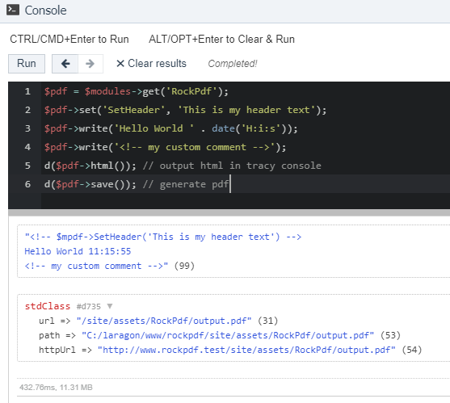

# RockPdf Docs

## Getting the mpdf instance

You can do anything that is possible with Mpdf using the mpdf instance:

```php
$pdf = $modules->get('RockPdf');
$mpdf = $pdf->mpdf;
```

See the mpdf docs: https://mpdf.github.io

## Helper shortcuts

Using mpdf directly can be fine, but this module ships with some helpers/shortcuts that make
working with mpdf and processwire easier. One example is debugging. When using Mpdf
debugging can be tedious because you might get some unwanted results in your pdf and
you don't know what's causing this problem. Getting only the generated HTML is also
not possible by default and you would need to implement some other output strategy like
shown here: https://mpdf.github.io/getting-started/html-or-php.html;

My solution is simple: There are some custom proxy functions that forward your instructions
to Mpdf and log this request as HTML comment. You can then output the generated HTML
**without generating the PDF** (wich is quicker and a lot easier to debug - think
of wrong filepaths for example). You can even use the tracy console to check your code:

```php
$pdf = $modules->get('RockPdf');
$pdf->set('SetHeader', 'This is my header text');
$pdf->write('Hello World ' . date('H:i:s'));
$pdf->write('<!-- my custom comment -->');
d($pdf->html()); // output html in tracy console
d($pdf->save()); // generate pdf
```

Output:




## Different output types

You can use these methods to output your pdf files:

* save() to save your file to the file system
* show() to directly show your file in the browser
* download() to force the browser to download the pdf

## Using fonts

By default MPdf ships with a lot of fonts making the module over 80MB large. I removed almost all of them and you can place the fonts you need in your sites assets folder `/site/assets/RockPdf/fonts`. See https://mpdf.github.io/fonts-languages/fonts-in-mpdf-7-x.html

* Get any TTF font and copy it to `site/assets/RockPdf/fonts`
* Import this font in your code:

```php
$pdf = $modules->get('RockPdf');
$pdf->settings([
  'fontdata' => (new \Mpdf\Config\FontVariables())->getDefaults()['fontdata'] + [
    'test' => [
      'R' => 'Garuda.ttf',
      'I' => 'Garuda.ttf',
    ]
  ],
]);
$mpdf = $pdf->mpdf;
$mpdf->WriteHTML('Hello World ' . date('H:i:s'));
$mpdf->WriteHTML('<p style="font-family: test;">Hello World ' . date('H:i:s') . '</p>');
$pdf->save();
```

## Setting a Background (using mpdf features)


Here the code to copy&paste

```php
$pdf = modules('RockPdf');
$mpdf = $pdf->mpdf;

// needs to be set before any output!
$mpdf->SetImportUse();
$mpdf->SetDocTemplate(config()->paths->assets . 'RockCRM/invoicebackgrounds/background.pdf');

$pdf->write('hello world ' . date('Ymd'));

d($pdf->save()->path);
```

## Page margins

```php
$pdf = $modules->get('RockPdf');
$pdf->settings([
  'margin_top' => 50,
]);
$pdf->write('hello world');
$pdf->save();
```
